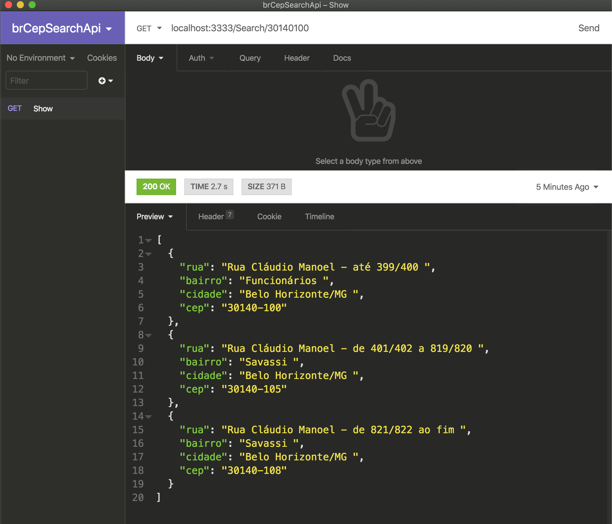

## Buscar CEP

Api que faz a utilização de Web Crawlers para buscar informações no site dos Correios.



### Bibliotecas utilizadas

- cheerio
- cors
- express
- puppeteer
- puppeteer-extra
- puppeteer-extra-plugin-stealth
- eslint
- nodemon
- prettier
- sucrase

### Instalação/Execução

```
git clone https://github.com/DanAraujjo/brCepSearchApi
cd brCepSearchApi
yarn
yarn dev
```

> Exemplo de requisição

```
curl --request GET \
  --url http://localhost:3333/Search/30140100
```
